# ChoresRewards

A self-hosted family hub for chores, rewards, meals, shopping, and the household calendar.

Kids complete chores, earn points (or pocket money), and redeem rewards. Parents get a single place for the weekly meal plan, shopping list, family events, sticky notes, and car/bill reminders. Built for a tablet on the fridge, a browser, or an Unraid box.

**GitHub:** [matda59/ChoresRewards](https://github.com/matda59/ChoresRewards)  
**Docker:** `ghcr.io/matda59/choresrewards:latest`  
**Unraid support:** [forum thread](https://forums.unraid.net/topic/192603-choresrewards-support-thread/)

---

## Screenshots

### Today at a Glance
Tasks left, meals, upcoming events, top rewards, family photos, and sticky notes — plus live clock and weather in the header.

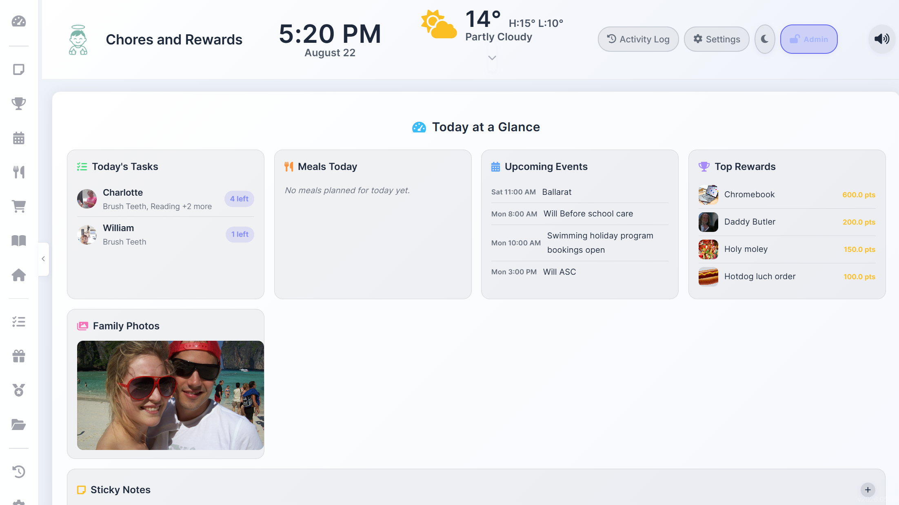

### Rewards
Custom rewards with photos, point costs, and progress toward redeeming.

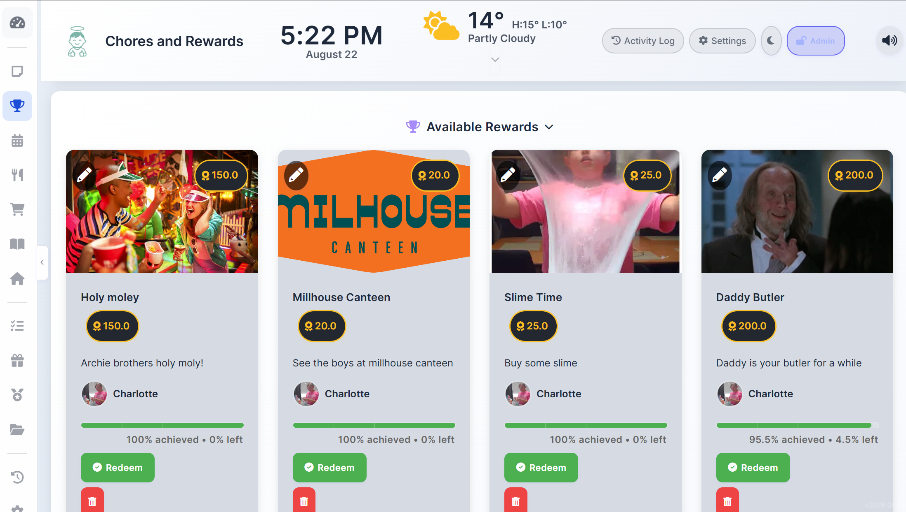

### Family calendar
Google Calendar week view with colour-coded events and a time grid.

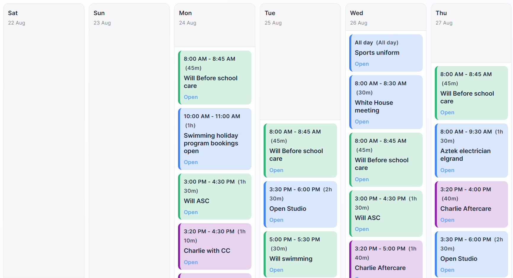

### Weekly meal planner
Plan breakfast, lunch, and dinner. Drag meals to swap. Click to edit.

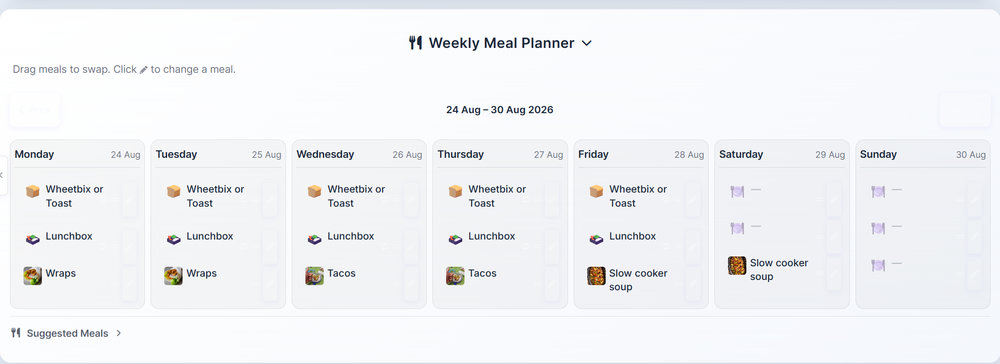

### Shopping list
Ingredients from this week's meals plus general shopping, split by store.

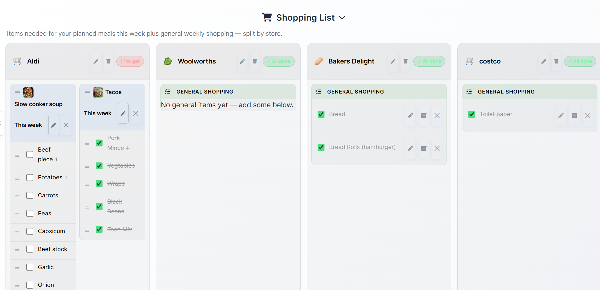

### Meal library
Save meals with ingredients, quantities, and which store they come from.

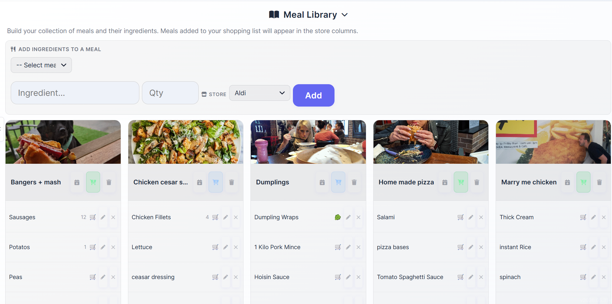

### Family chores
Per-child kanban columns with points, streaks, badges, emoji icons, and Complete buttons.

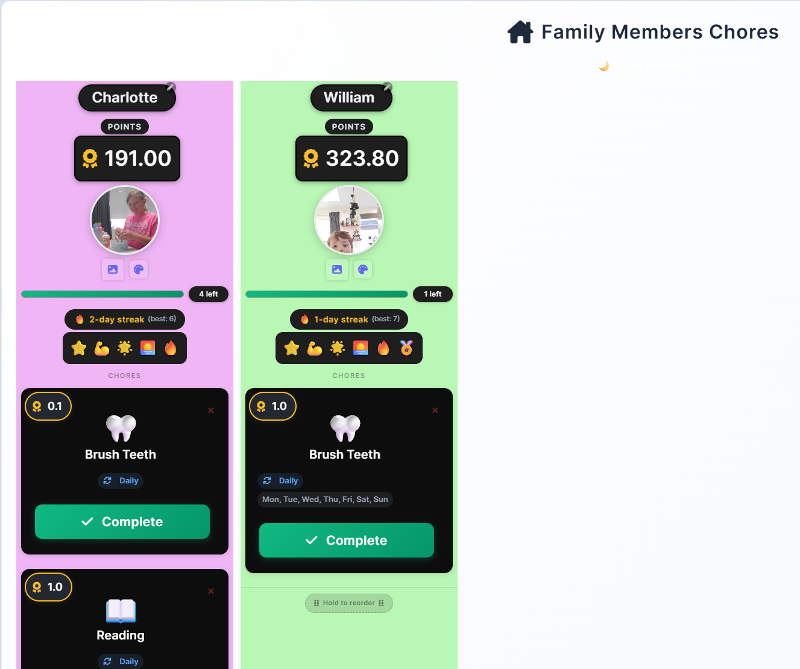

### Organise
Cars, insurance, bills, and service history with due dates and mileage.

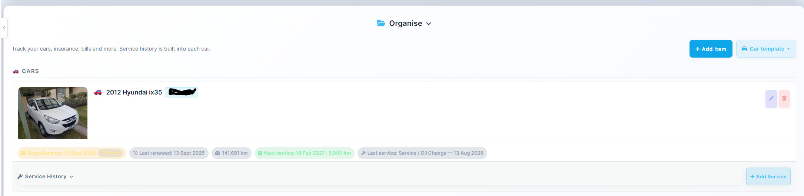

### Sticky notes
Colour-coded, resizable notes on the dashboard.

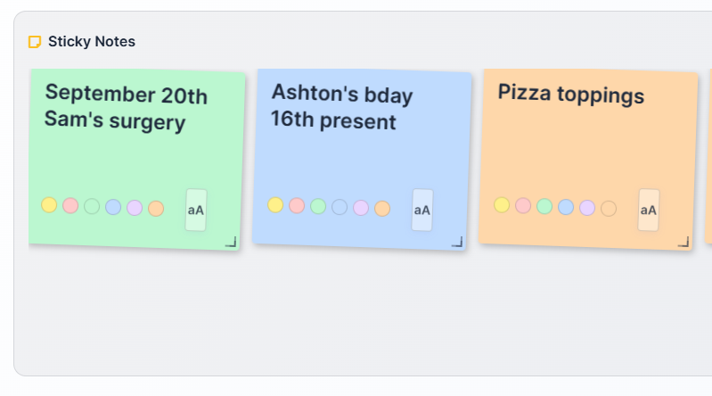

### Settings
Points or cash, family members, bonus points, custom sounds, Gotify, quizzes, and a photo screensaver.

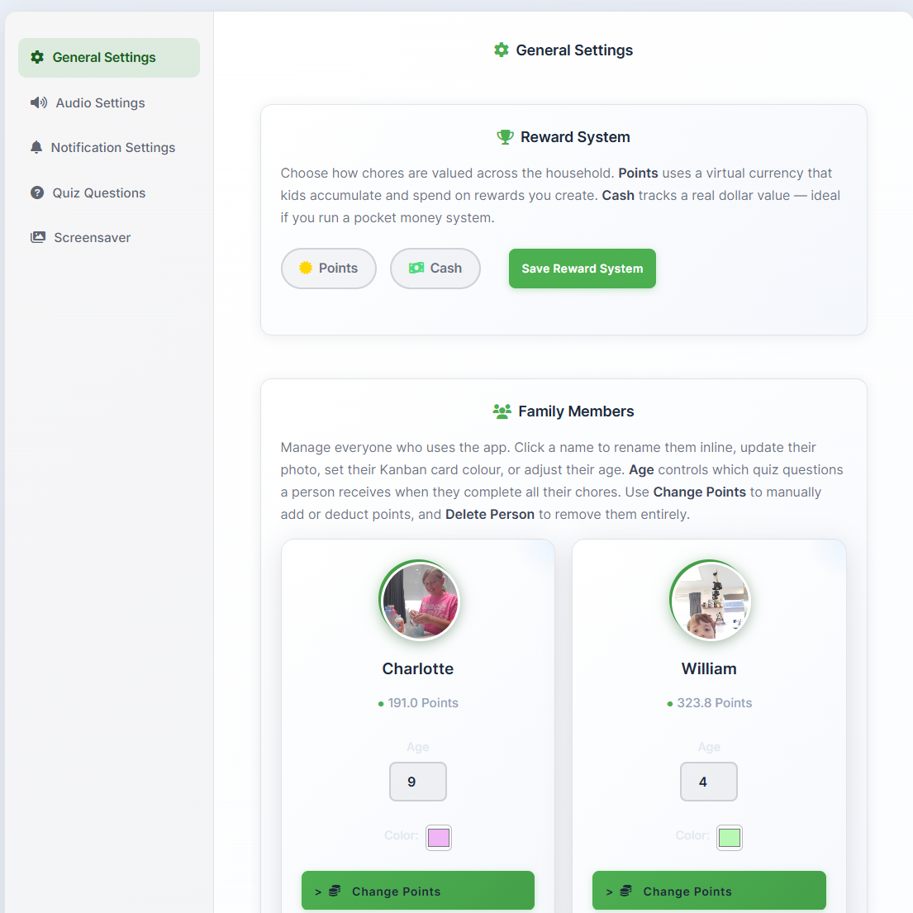
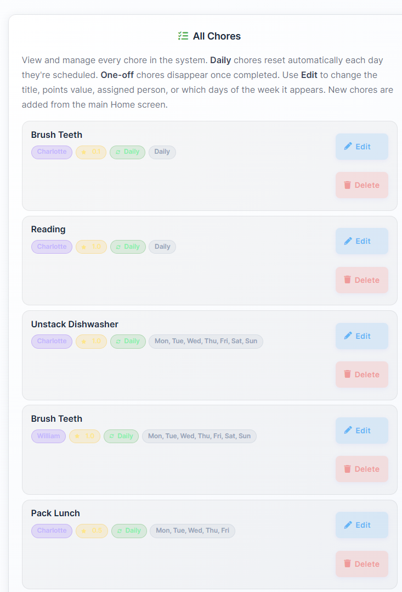
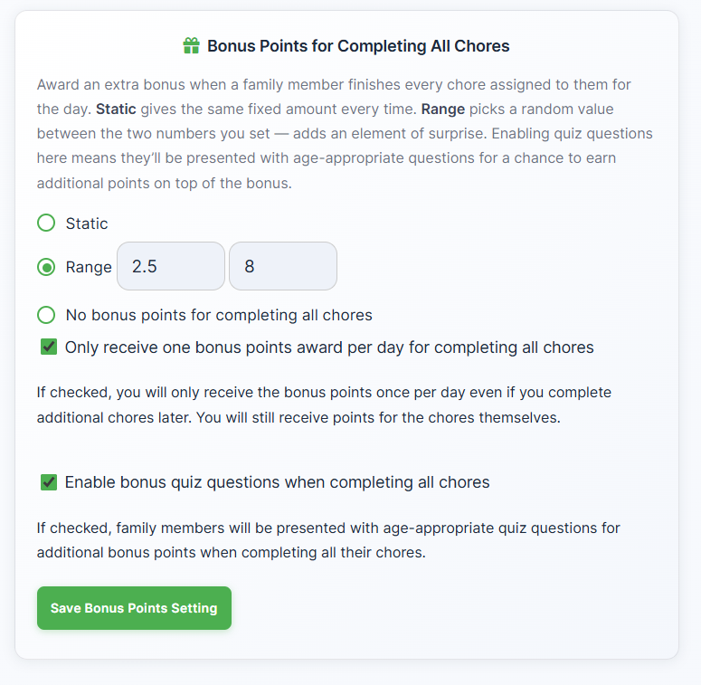
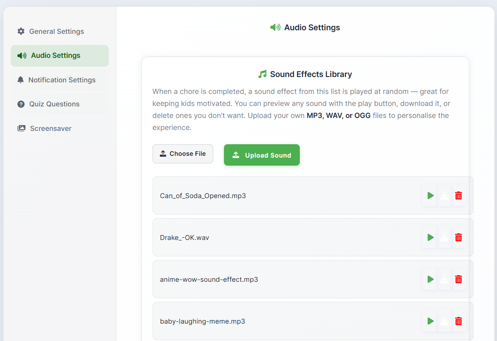
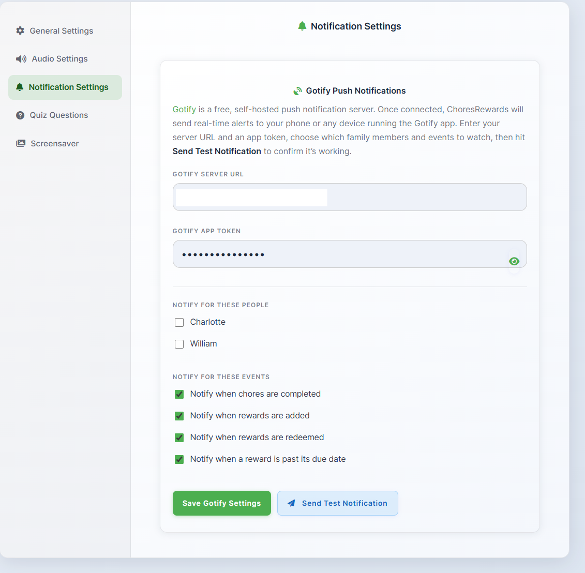
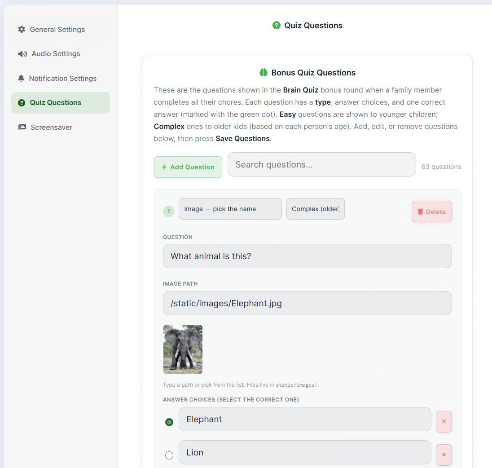
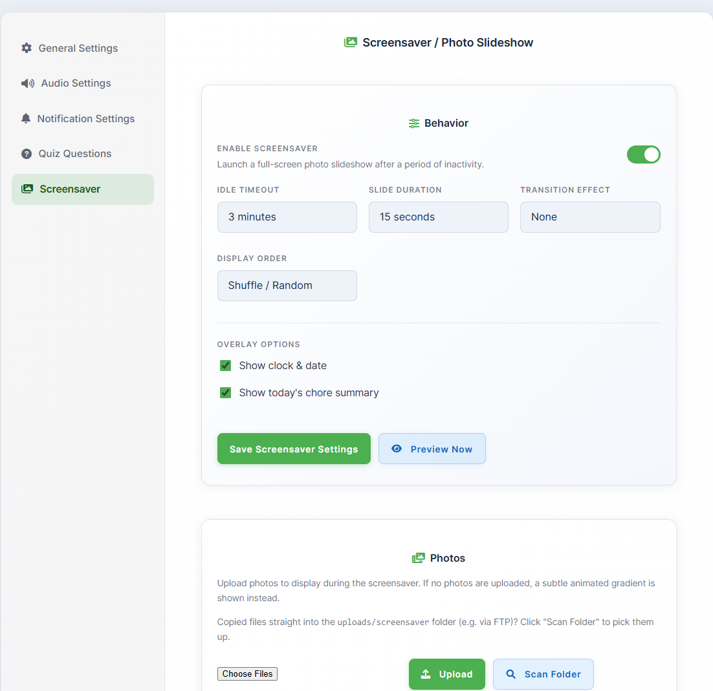

---

## Features

### Chores & rewards
- Per-person chore columns with custom colours, avatars, and emoji icons
- Daily chores that reset automatically, or one-off chores that disappear when done
- Schedule chores for specific days of the week
- Decimal point values (e.g. 0.1 for brushing teeth)
- Drag and drop to reorder chores
- Points **or** cash / pocket-money mode
- Bonus points when all chores are done — fixed amount, or a random range
- Optional age-appropriate Brain Quiz for extra bonus points
- Custom sound effects on chore complete (upload MP3, WAV, or OGG)
- Celebrations when a kid finishes everything
- Streaks and badges (first chore, 10/50/100 chores, perfect day, early bird, 3/7/30-day streaks)
- 4-digit master PIN so kids can't change settings

### Household
- **Dashboard** — today's leftover chores, meals, events, rewards, and family photos
- **Weather** — current conditions plus a 7-day forecast in the sticky header
- **Google Calendar** — family week view with colour rules, time-grid or list
- **Meal planner** — weekly plan with suggested meals and drag-to-swap
- **Shopping list** — meal ingredients + general items, grouped by store (Aldi, Woolworths, etc.)
- **Meal library** — recipes/ingredients you reuse each week
- **Sticky notes** — resizable, colour-coded, with a text-size toggle
- **Organise** — cars, rego, insurance, bills, and per-car service history
- **Screensaver** — full-screen family photo slideshow after idle, with clock and today's chore summary
- **Gotify** — self-hosted push notifications for chore complete, reward added/redeemed, overdue rewards
- **Activity log** — history of what happened and who did it
- Dark and light themes

### Family-friendly
- First-run setup wizard
- Admin lock on the sidebar
- Age field drives quiz difficulty (easy vs complex)
- Tuned for an always-on tablet / low-end hardware

---

## Quick start (Docker)

```bash
docker run -d \
  --name choresrewards \
  -p 3112:3000 \
  -e TZ=Australia/Adelaide \
  -e ENABLE_GOOGLE_CALENDAR=true \
  -v choresrewards_data:/app/instance \
  -v choresrewards_uploads:/app/static/uploads \
  --restart unless-stopped \
  ghcr.io/matda59/choresrewards:latest
```

Open `http://localhost:3112` and complete the setup wizard.

Map **both** volumes. Uploads (avatars, reward photos, screensaver pictures, organise photos) live under `/app/static/uploads` and will disappear on container update if that path is not persisted.

### Docker Compose

```yaml
services:
  choresawards:
    image: ghcr.io/matda59/choresrewards:latest
    ports:
      - "3112:3000"
    volumes:
      - ./instance:/app/instance
      - uploads_data:/app/static/uploads
    environment:
      - TZ=Australia/Adelaide
      - ENABLE_GOOGLE_CALENDAR=true
    restart: always

volumes:
  uploads_data:
```

```bash
docker compose up -d
```

### Unraid

Install from Community Applications, or use the template pointing at `ghcr.io/matda59/choresrewards:latest`.

| Path / port | Container | Purpose |
|---|---|---|
| appdata folder | `/app/instance` | SQLite database |
| uploads folder | `/app/static/uploads` | Photos and custom sounds |
| `3112` | `3000` | Web UI |
| `TZ` | | Your timezone |
| `ENABLE_GOOGLE_CALENDAR` | `true` | Show Google Calendar settings |

---

## Local nightly channel

Test new features (Google Calendar, screensaver, etc.) without touching a stable `latest` deploy.

```powershell
docker compose -f docker-compose.nightly.yml up --build -d
```

- Nightly URL: `http://localhost:3113`
- Data volume: `nightly_instance_data`
- Uploads volume: `nightly_uploads_data`

Stop:

```powershell
docker compose -f docker-compose.nightly.yml down
```

Rebuild after code changes:

```powershell
docker compose -f docker-compose.nightly.yml up --build -d
```

This is local-only. It does not push to GitHub or GHCR.

---

## Optional: Google Calendar

1. Set `ENABLE_GOOGLE_CALENDAR=true`
2. In Settings, enable Google Calendar
3. Add Calendar ID(s)
4. Upload a Google service-account JSON key
5. Share each calendar with the service-account email

Colour rules let you tint events (e.g. Will vs Charlie vs household).

---

## Optional: Gotify

In **Settings → Notification Settings**, add your Gotify server URL and app token. Choose which family members and events to notify on, then send a test notification.

---

## Tech

- Python / Flask / SQLite
- Gunicorn in Docker
- Image: `ghcr.io/matda59/choresrewards:latest` (and `:nightly`)
- Port **3000** in the container

No cloud account required. Everything stays on your server except optional Google Calendar and weather lookups.
